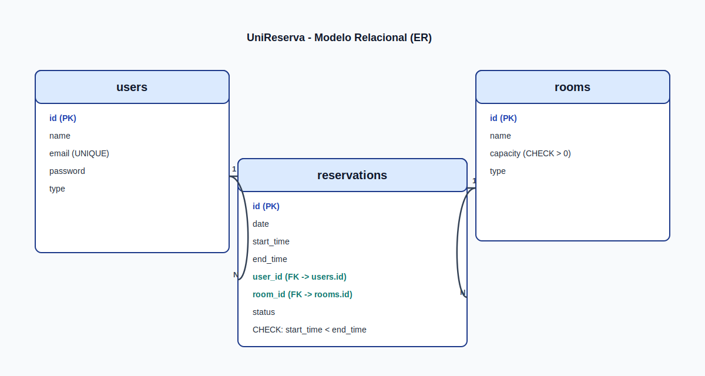
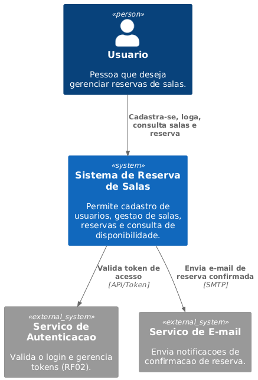
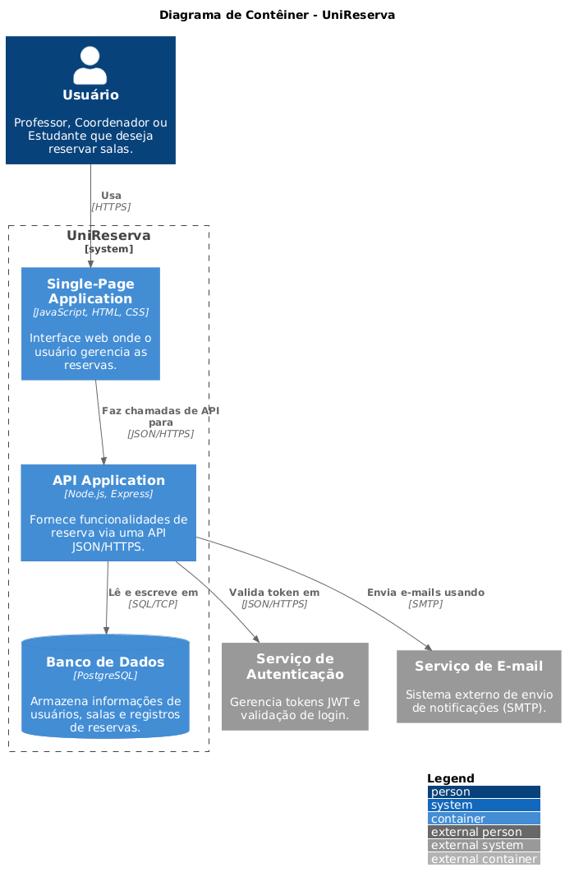
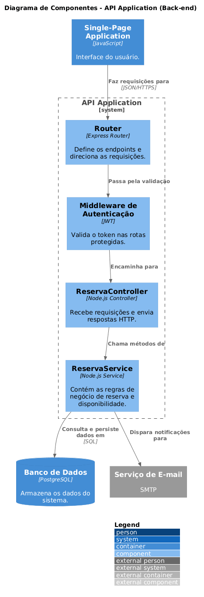

  

<h2 align="center"> UniReserva </h2>

  
  
  
  
  

  <h2> Descrição do Projeto </h2>
  
Sistema Web para gerenciamento de reservas de salas em instituições educacionais. Projeto acadêmico desenvolvido para a disciplina de Programação Web do curso de Engenharia de Software da instituição Centro Universitário Católica de Santa Catarina.

  <h2>Domínio do Problema</h2>
  
Instituições de ensino frequentemente enfrentam dificuldades no controle de reservas de salas de aula e laboratórios. Muitas vezes o processo é manual, sujeito a conflitos de horário e falta de organização. 

  
O sistema proposto tem como objetivo permitir que usuários autenticados realizem reservas de salas, consultem disponibilidade e gerenciem suas solicitações de forma organizada e segura.

  <h2> Público-Alvo</h2>
  <ul>
    <li>
Professores
</li>
    <li>
Coordenadores
</li>
    <li>
Estudantes (caso permitido)
</li>
  </ul>

  <h2> Funcionalidades</h2>
  <ul>
    <li><h3>Requisitos Funcionais</h3></li>
    <ul>
      <li>
RF01 – O sistema deve permitir cadastro de usuário
</li>
      <li>
RF02 – O sistema deve permitir login com autenticação por token
</li>
      <li>
RF03 - O sistema deve permitir cadastro de salas
</li>
      <li>
RF04 - O sistema deve permitir consultar disponibilidade de salas
</li>
      <li>
RF05 - O sistema deve permitir realizar reserva de sala
</li>
      <li>
RF06 - O sistema deve impedir reservas em horários já ocupados
</li>
      <li>
RF07 - O sistema deve permitir cancelar reserva
</li>
    </ul>
    <li><h3>Requisitos Não Funcionais</h3></li>
    <ul>
      <li>
RNF01 - O sistema deve seguir arquitetura MVC
</li>
      <li>
RNF02 - O sistema deve disponibilizar API REST
</li>
      <li>
RNF03 – O sistema deve utilizar banco de dados relacional
</li>
      <li>
RNF04 – O sistema deve ser implantado online
</li>
      <li>
RNF05 – O sistema deve utilizar controle de acesso com autenticação
</li>
    </ul>
  </ul>

  <h2>Transação do Problema</h2>
  <ul>
      <li>
O sistema verifica se a sala está disponível
</li>
      <li>
Caso esteja:

      <ul>
        <li>
Registra a reserva
</li>
        <li>
Marca o horário como ocupado
</li>
      </li>
      </ul>
        <li>
Caso não esteja:

      <ul>
        <li>
Retorna um erro
</li>
      </ul>
        </li>
  </ul>
  

  <h2> Modelo Entidade Banco</h2>
  <h3>Diagrama do Banco de Dados</h3>
  
Imagem do modelo relacional baseada em <code>db/schema.sql</code>:

  

    
  

  <h2>Tecnologias Utilizadas</h2>
  <h3>Back-end: Node.js + Express</h3>
  
O back-end será desenvolvido utilizando Node.js, com o framework Express.

  
<b>Justificativa:</b>

  <ul>
    <li>
Ambiente leve e eficiente para construção de APIs REST.
</li>
    <li>
Grande adoção no mercado.
</li>
    <li>
Facilidade na implementação de rotas, middlewares e autenticação com JWT.
</li>
    <li>
Permite organização em padrão MVC.
</li>
  </ul>
   
  <h3>Banco de Dados: PostgreSQL</h3>
  
Será utilizado PostgreSQL como sistema gerenciador de banco de dados relacional.

  
<b>Justificativa:</b>

  <ul>
    <li>
Banco relacional robusto e open source.
</li>
    <li>
Suporte a transações (ACID).
</li>
    <li>
Ideal para controle de integridade em reservas (evitar conflitos de horário).
</li>
    <li>
Amplamente utilizado em aplicações web.
</li>
  </ul>
   
  <h3>Front-end: HTML + CSS + JavaScript</h3>
  
O front-end será desenvolvido utilizando tecnologias web padrão.

  
<b>Justificativa:</b>

  <ul>
    <li>
Simplicidade na implementação.
</li>
    <li>
Controle total da estrutura e integração com API REST.
</li>
    <li>
Evita complexidade de frameworks adicionais.
</li>
    <li>
Ideal para foco nos conceitos da disciplina.
</li>
  </ul>
   
  <h3>Arquitetura</h3>
  <ul>
    <li>
Arquitetura Cliente-Servidor
</li>
    <li>
API REST
</li>
    <li>
Padrão MVC no back-end
</li>
    <li>
Aplicação monolítica
</li>
  </ul>
  
<b>Justificativa:</b>

  <ul>
    <li>
Separação clara entre responsabilidades.
</li>
    <li>
Organização do código.
</li>
    <li>
Facilita manutenção e escalabilidade futura.
</li>
  </ul>
   
  <h3>Autenticação</h3>
  <ul>
    <li>
JWT (JSON Web Token)
</li>
  </ul>
  
<b>Justificativa:</b>

  <ul>
    <li>
Controle de acesso baseado em token.
</li>
    <li>
Segurança para rotas protegidas.
</li>
    <li>
Muito utilizado em APIs modernas.
</li>
  </ul>
   
  <h3>DevOps e CI/CD</h3>
  <ul>
    <li>
GitHub Actions (workflow automático)
</li>
    <li>
Docker e Docker Compose
</li>
    <li>
ESLint (code quality)
</li>
    <li>
Testes automatizados com Node.js test runner
</li>
  </ul>
  
<b>Justificativa:</b>

  <ul>
    <li>
Automação de testes e validações em cada push.
</li>
    <li>
Deploy facilitado com containers Docker.
</li>
    <li>
Manutenção de qualidade de código constante.
</li>
    <li>
Preparado para ambientes de produção.
</li>
  </ul>
   
  <h3>Observabilidade</h3>
  <ul>
    <li>
Logger estruturado em JSON
</li>
    <li>
Request logging automático via middleware
</li>
    <li>
Suporte para integração com Sentry, Winston, Prometheus e DataDog
</li>
  </ul>
  
<b>Justificativa:</b>

  <ul>
    <li>
Rastreamento de erros e performance.
</li>
    <li>
Facilita troubleshooting em produção.
</li>
    <li>
Preparado para escalabilidade.
</li>
  </ul>

  <h2>Arquitetura C4</h2>
  
<a href="c4-context.puml">Fonte - Nível 1 (Contexto)</a>

  
<a href="c4-container.puml">Fonte - Nível 2 (Contêiner)</a>

  
<a href="c4-components.puml">Fonte - Nível 3 (Componentes)</a>

  

    
  

  <h3>Nível 1 – Diagrama de Contexto</h3>
  
Visão geral do sistema e seus atores externos:

  <ul>
    <li>
<b>Usuário (Professor / Coordenador / Estudante)</b> → interage com o sistema via navegador web para realizar reservas de salas.
</li>
    <li>
<b>UniReserva (Sistema Web)</b> → processa as solicitações, autentica usuários e gerencia as reservas.
</li>
    <li>
<b>Banco de Dados (PostgreSQL)</b> → armazena os dados de usuários, salas e reservas.
</li>
  </ul>

  <h3>Nível 2 – Diagrama de Contêiner</h3>
  

    
  

  
Componentes principais do sistema:

  <ul>
    <li>
<b>Front-end (HTML + CSS + JavaScript)</b> → interface web executada no navegador do usuário. Consome a API REST.
</li>
    <li>
<b>Back-end / API REST (Node.js + Express)</b> → responsável pelas regras de negócio, autenticação JWT e comunicação com o banco de dados. Organizado no padrão MVC.
</li>
    <li>
<b>Banco de Dados (PostgreSQL)</b> → armazena e persiste os dados do sistema.
</li>
  </ul>

  <h3>Nível 3 – Diagrama de Componentes (Back-end)</h3>
  

    
  

  
Componentes internos da API:

  <ul>
    <li>
<b>Router (Rotas Express)</b> → define os endpoints da API REST e direciona as requisições.
</li>
    <li>
<b>Controller</b> → recebe as requisições HTTP, chama os serviços e retorna as respostas.
</li>
    <li>
<b>Service / Model</b> → contém as regras de negócio e realiza as operações no banco de dados.
</li>
    <li>
<b>Middleware de Autenticação (JWT)</b> → valida o token nas rotas protegidas antes de permitir o acesso.
</li>
  </ul>

  <h2>Entrega Atual – Pronto para Produção</h2>
  
Nesta etapa final, a implementação evoluiu para um padrão <b>production-ready</b>, incluindo CI/CD automático, testes abrangentes, deployment documentado e observabilidade integrada.

  <h3>Artefatos Disponíveis no Repositório</h3>
  <ul>
    <li>
<b>Front-end:</b> interface web em <code>public/index.html</code>, <code>public/styles.css</code> e <code>public/app.js</code>.
</li>
    <li>
<b>Back-end:</b> API REST em Node.js + Express, organizada em padrão MVC na pasta <code>src</code>.
</li>
    <li>
<b>Banco de dados:</b> schema em <code>db/schema.sql</code>, seed em <code>db/seed.sql</code>, script de inicialização em <code>scripts/initDb.js</code>.
</li>
    <li>
<b>Testes automatizados:</b> testes de integração em <code>test/api.test.js</code> e testes unitários em <code>test/services.test.js</code> (18+ testes).
</li>
    <li>
<b>CI/CD Pipeline:</b> workflow automático em <code>.github/workflows/ci.yml</code> com testes, linting, auditoria de segurança e build Docker.
</li>
    <li>
<b>Configuração de Produção:</b> <code>Dockerfile</code> otimizado, <code>docker-compose.prod.yml</code> e <code>docs/DEPLOYMENT.md</code> com guias de deployment.
</li>
    <li>
<b>Observabilidade:</b> logger estruturado em <code>src/utils/logger.js</code>, middleware de logging HTTP e documentação em <code>docs/OBSERVABILITY.md</code>.
</li>
    <li>
<b>Documentação:</b> <code>README.SETUP.md</code> (setup e troubleshooting), <code>IMPLEMENTATION_SUMMARY.md</code> (resumo técnico), <code>QUICK_START_DEPLOY.md</code> (deploy rápido).
</li>
    <li>
<b>Arquitetura C4:</b> diagramas em <code>c4-context.puml</code>, <code>c4-container.puml</code> e <code>c4-components.puml</code>.
</li>
  </ul>

  <h3>Escopo Implementado Nesta Entrega</h3>
  <ul>
    <li>
<b>Autenticação:</b> geração e validação de token JWT com proteção de rotas.
</li>
    <li>
<b>API REST:</b> consulta de salas, criação e cancelamento de reservas com validação de conflitos.
</li>
    <li>
<b>Interface Web:</b> páginas de login, listagem de salas e gerenciamento de reservas.
</li>
    <li>
<b>CI/CD Pipeline (✨ NOVO):</b> workflow automático no GitHub Actions com testes, linting (ESLint), security audit e Docker build validation.
</li>
    <li>
<b>TDD - Testes Unitários (✨ NOVO):</b> 18+ testes que cobrem services de autenticação, salas e reservas com validações e casos de erro.
</li>
    <li>
<b>Deployment em Produção (✨ NOVO):</b> Dockerfile otimizado, docker-compose.prod.yml e documentação para Railway, Render, Docker VPS e AWS.
</li>
    <li>
<b>Observabilidade e Monitoramento (✨ NOVO):</b> logger estruturado JSON, middleware de HTTP request logging, documentação de integração com Winston, Sentry, Prometheus e DataDog.
</li>
    <li>
<b>Code Quality:</b> ESLint configurado, cobertura de testes, npm audit automático.
</li>
  </ul>

  <h3>Ajustes de Requisitos Identificados</h3>
  <ul>
    <li>
<b>AR01:</b> o requisito RNF03 foi atendido nesta iteração com integração real ao PostgreSQL, incluindo schema, seed e script de inicialização.
</li>
    <li>
<b>AR02:</b> o requisito RF02 foi detalhado como autenticação via JWT com proteção das rotas privadas da API.
</li>
    <li>
<b>AR03:</b> o requisito RF06 foi detalhado com a regra de conflito por sala, data e sobreposição de horários.
</li>
    <li>
<b>AR04:</b> para facilitar a avaliação local, foi incluída uma estratégia de demo com <code>docker-compose</code> e variáveis em <code>.env.example</code>.
</li>
  </ul>

  <h3>Estrutura Inicial do Projeto</h3>
  <ul>
    <li>
<code>src/controllers</code> → recebe as requisições HTTP e retorna respostas.
</li>
    <li>
<code>src/services</code> → concentra regras de negócio.
</li>
    <li>
<code>src/repositories</code> → executa consultas SQL no PostgreSQL.
</li>
    <li>
<code>src/routes</code> → define endpoints da API REST.
</li>
    <li>
<code>src/middleware</code> → valida autenticação e permissões.
</li>
    <li>
<code>src/config</code> → centraliza conexão com banco e bootstrap da base.
</li>
    <li>
<code>db</code> → guarda os scripts SQL de schema e seed.
</li>
    <li>
<code>scripts</code> → contém scripts auxiliares, como inicialização do banco.
</li>
    <li>
<code>public</code> → contém a interface web inicial.
</li>
  </ul>

  <h3>Como Executar</h3>
  <ol>
    <li>
Copiar <code>.env.example</code> para um arquivo <code>.env</code> e ajustar as variáveis se necessário.
</li>
    <li>
Instalar dependências com <code>npm install</code>.
</li>
    <li>
Subir o PostgreSQL com <code>npm run db:up</code> (requer Docker instalado).
</li>
    <li>
Inicializar schema e seed com <code>npm run db:init</code>.
</li>
    <li>
Iniciar a aplicação com <code>npm start</code>.
</li>
    <li>
Acessar <code>http://localhost:3000</code> no navegador.
</li>
  </ol>

  <h3>Scripts Disponíveis</h3>
  <ul>
    <li>
<code>npm start</code> → inicia o servidor Node.js
</li>
    <li>
<code>npm test</code> → executa testes de integração e unitários
</li>
    <li>
<code>npm run test:coverage</code> → executa testes com cobertura
</li>
    <li>
<code>npm run lint</code> → verifica qualidade do código com ESLint
</li>
    <li>
<code>npm run lint:fix</code> → corrige problemas de linting automaticamente
</li>
    <li>
<code>npm run db:init</code> → inicializa banco de dados
</li>
    <li>
<code>npm run db:up</code> → inicia PostgreSQL com Docker Compose
</li>
    <li>
<code>npm run db:down</code> → para PostgreSQL
</li>
  </ul>

  <h3>CI/CD e Deployment</h3>
  <ul>
    <li>
<b>Workflow Automático:</b> Todo push para <code>main</code> ou PR dispara pipeline em <code>.github/workflows/ci.yml</code> que executa testes, linting, security audit e valida build Docker.
</li>
    <li>
<b>Deploy para Produção:</b> Ver documentação em <code>docs/DEPLOYMENT.md</code> para opções de Railway, Render, Docker VPS ou AWS.
</li>
    <li>
<b>Quick Start Deploy:</b> Ver <code>QUICK_START_DEPLOY.md</code> para deploy em Railway em 5 minutos.
</li>
    <li>
<b>Status da Pipeline:</b> <a href="https://github.com/seu-usuario/UniReserva/actions">GitHub Actions</a>
</li>
  </ul>

  <h3>Validação da Entrega</h3>
  <ul>
    <li>
<b>Testes Automatizados:</b> 23 testes passando com <code>npm test</code> (testes de integração + unitários).
</li>
    <li>
<b>Code Quality:</b> ESLint validado com <code>npm run lint</code> (zero warnings).
</li>
    <li>
<b>Security:</b> <code>npm audit</code> rodando automaticamente na pipeline.
</li>
    <li>
<b>CI/CD Pipeline:</b> workflow no GitHub Actions (<code>.github/workflows/ci.yml</code>) executa automaticamente em push/PR para main/develop.
</li>
    <li>
<b>Docker Build:</b> Dockerfile validado como parte da pipeline.
</li>
    <li>
<b>Coverage:</b> cobertura de testes coletada com <code>npm run test:coverage</code>.
</li>
    <li>
<b>Aplicação Local:</b> <code>npm start</code> inicia servidor em http://localhost:3000.
</li>
  </ul>

  <h3>Documentação Adicional</h3>
  <ul>
    <li>
<b><a href="README.SETUP.md">README.SETUP.md</a></b> → Setup completo, troubleshooting e FAQ.
</li>
    <li>
<b><a href="IMPLEMENTATION_SUMMARY.md">IMPLEMENTATION_SUMMARY.md</a></b> → Resumo técnico de todas as implementações.
</li>
    <li>
<b><a href="QUICK_START_DEPLOY.md">QUICK_START_DEPLOY.md</a></b> → Deploy rápido em Railway.
</li>
    <li>
<b><a href="docs/DEPLOYMENT.md">docs/DEPLOYMENT.md</a></b> → Guia completo de deployment em produção.
</li>
    <li>
<b><a href="docs/OBSERVABILITY.md">docs/OBSERVABILITY.md</a></b> → Implementação de observabilidade, logging e monitoramento.
</li>
  </ul>

  <h3>Usuários de Demonstração</h3>
  <ul>
    <li>
<b>Administrador:</b> <code>admin@unireserva.com</code> / <code>admin123</code>
</li>
    <li>
<b>Professor:</b> <code>professor@unireserva.com</code> / <code>prof123</code>
</li>
  </ul>

 
  
  
  
  
  
  
  
  
  

